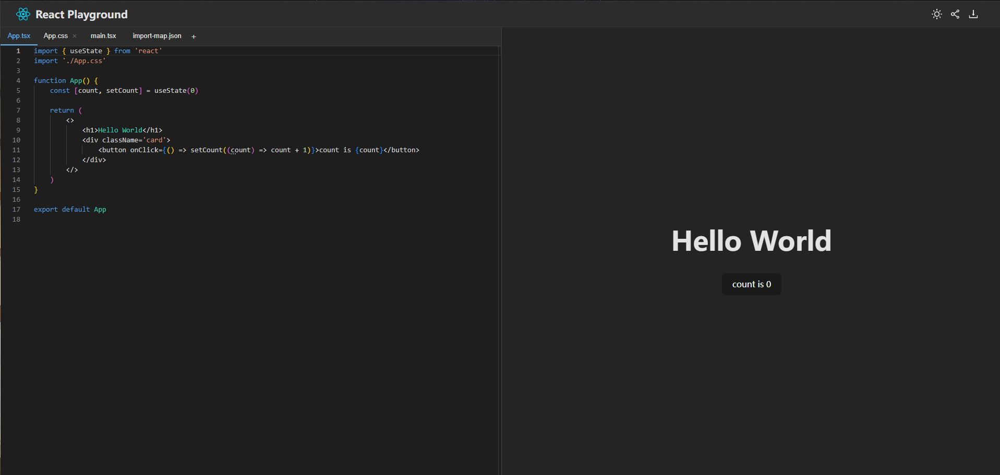

<h1 align="center">React-Playground</h1>

简洁，美观，功能齐全的React在线代码编辑器

## ⭐说明

- 练习作品，没有经过严格测试，可能会有bug，请即使反馈
- 用 @monaco-editor/react 实现了网页版 typescript 编辑器，并且实现了自动类型导入
- 通过 @babel/standalone 实现了文件编译，并且写了一个 babel 插件实现了 import 的 source 的修改
- 采用css in js的方案,支持dark和light两种主题切换
- 支持代码下载和文件分享功能
- 通过 blob url 来内联引入其他模块的代码，通过 import maps 支持引入react、react-dom 等第三方包的代码
- 通过 postMessage 和父窗口通信来显示代码运行时的错误
- 通过 Performance 分析性能问题，并通过 Web Worker 拆分代码编译逻辑到 worker 线程来进行性能优化，消除了 long lask
